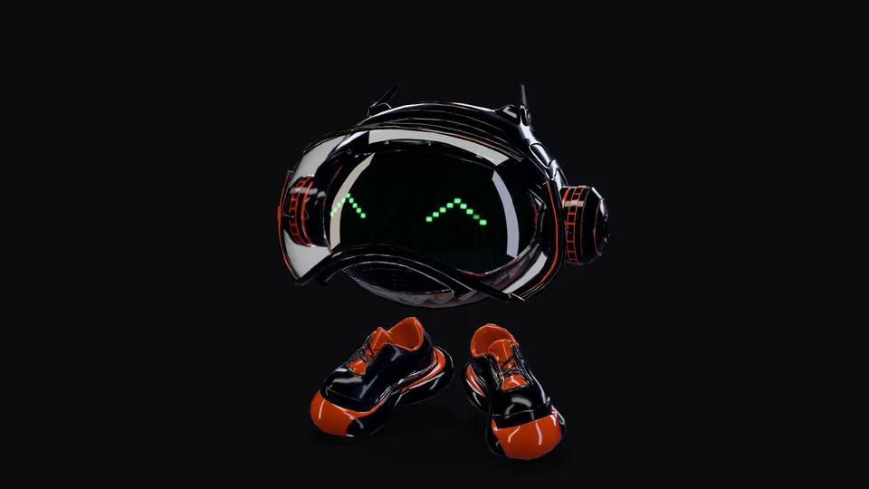
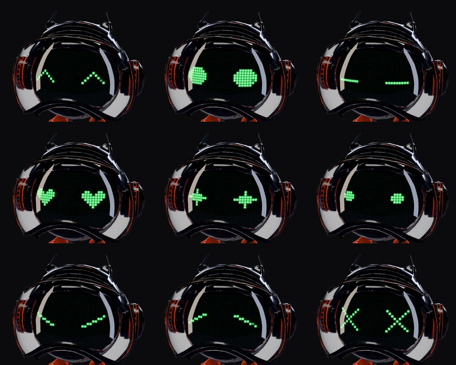
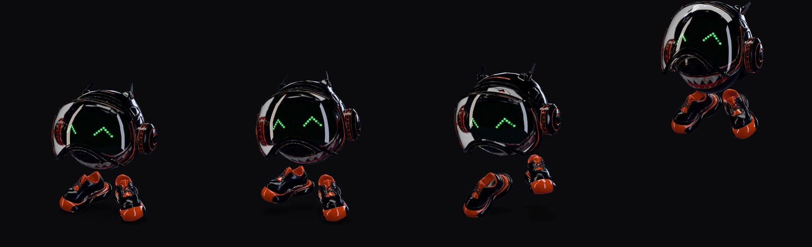

# Funくん（Funkun）— 3D モデル

[English](README.md)

<p align="center">
  
</p>

<p align="center">
  <a href="https://funtechinc.github.io/character-model/"><b>ブラウザで見る</b></a> ·
  <a href="https://github.com/FunTechInc/character-model/raw/main/models/funkun.glb">funkun.glb をダウンロード</a> ·
  <a href="#ライセンス">ライセンス：CC BY-NC 4.0</a>
</p>

Funくんは FunTech のキャラクターです。顔が LED のスクリーンになった、つやのある黒い球体に、ヘッドホンとバイザー、
そしてスニーカー。このリポジトリは、FunTech が社内で制作した Funくん の 3D モデルを glTF 2.0 で公開するものです。
**9 種類の表情**と**4 種類のアニメーション**を 1 つのファイルに収めていて、three.js、`<model-viewer>`、Blender、Unity、
Unreal でそのまま使えます。

- [プレビュー](#プレビュー)
- [ファイル](#ファイル)
- [表情](#表情) · [アニメーション](#アニメーション)
- [使い方](#使い方)：three.js · model-viewer · Blender · Unity / Unreal · CDN
- [仕様](#仕様)：大きさ・座標・パーツ・マテリアル
- [ライセンス](#ライセンス)

## プレビュー

**ブラウザで：https://funtechinc.github.io/character-model/**。回して見る、アニメーションを再生する、表情を切り替える、
ファイルをダウンロードする、ができます。スマホでは *View in your space* から、部屋の中に Funくん を置けます（AR）。

URL のパラメータで状態を指定できます（共有や、`ui=0` での埋め込みに）。

| パラメータ | 値 | |
|---|---|---|
| `anim` | `Idle` · `Dance` · `Run` · `Jump` | アニメーション（既定は `Idle`） |
| `face` | `happy` · `open` · `blink` · `heart` · `star` · `dot` · `angry` · `sad` · `dead` | 表情（既定は `happy`） |
| `bg` | `dark` · `light` | 背景 |
| `model` | `standard` | `funkun_web.glb` の代わりに `funkun.glb` を表示 |
| `ui` | `0` | モデルだけ（ボタンなし） |

例：[`?anim=Dance&face=heart`](https://funtechinc.github.io/character-model/?anim=Dance&face=heart)

ビューアはファイルをそのまま表示します。マテリアルや光、表情をコードで足していないので、見えているものがダウンロードされるものです。

手元で見るには：

```bash
npm install
npm run dev        # http://localhost:5210/
```

## ファイル

| ファイル | 三角形 | 容量 | 用途 |
|---|---:|---:|---|
| [`models/funkun.glb`](models/funkun.glb) | 70,000 | 3.0 MB | ほとんどの用途に。圧縮なしで、どの glTF ツールでも開けます |
| [`models/funkun_web.glb`](models/funkun_web.glb) | 30,000 | 0.7 MB | Web 用。形状は meshopt 圧縮、テクスチャは WebP |
| `funkun_hd.glb`（[Releases](https://github.com/FunTechInc/character-model/releases/latest)） | 955,900 | 25 MB | 静止画や寄りの絵に。元の解像度のまま、圧縮なし |

3 つは同じシーンです。パーツ・名前・回転の中心・マテリアル・表情・アニメーションはすべて共通で、三角形の数と圧縮だけが違います。
3 つとも Khronos の [glTF Validator](https://github.khronos.org/glTF-Validator/) でエラー 0・警告 0 です。

## 表情

<p align="center"></p>

| | | |
|---|---|---|
| `happy`（既定） | `open` | `blink` |
| `heart` | `star` | `dot` |
| `angry` | `sad` | `dead` |

表情はスクリーンの**マテリアルバリアント**です（[`KHR_materials_variants`](https://github.com/KhronosGroup/glTF/tree/main/extensions/2.0/Khronos/KHR_materials_variants)）。
1 つずつが、発光する LED マトリクスのテクスチャになっています。model-viewer なら `variant-name`、Blender なら *glTF Variants* パネル、
three.js なら数行で切り替えられます（[下記](#threejs)）。

## アニメーション

<p align="center"></p>

| 名前 | 長さ | |
|---|---:|---|
| `Idle` | 6.0 秒 | 呼吸とゆっくりした揺れ |
| `Dance` | 1.67 秒 | 144 BPM で 4 拍。拍で弾み、靴が交互にタップ |
| `Run` | 0.38 秒 | その場で 1 歩分の走り |
| `Jump` | 1.6 秒 | かがむ・跳ぶ・着地、少し休む |

どれも継ぎ目なくループします。Funくん にはボーン（スケルトン）がなく、アニメーションはパーツを動かしています（[パーツ](#パーツ)）。
どのアニメーションも動くパーツすべてにキーを持っているので、切り替えてもパーツが前の位置に取り残されることはありません。

## 使い方

### three.js

```js
import * as THREE from 'three';
import { GLTFLoader } from 'three/addons/loaders/GLTFLoader.js';

const gltf = await new GLTFLoader().loadAsync('funkun.glb');
scene.add(gltf.scene);

// アニメーション
const mixer = new THREE.AnimationMixer(gltf.scene);
mixer.clipAction(THREE.AnimationClip.findByName(gltf.animations, 'Dance')).play();
// 毎フレーム：mixer.update(経過秒)

// 表情（KHR_materials_variants）
const faces = gltf.userData.gltfExtensions.KHR_materials_variants.variants.map((v) => v.name);
const screen = gltf.scene.getObjectByName('Screen');
async function setFace(name) {
  const { mappings } = screen.userData.gltfExtensions.KHR_materials_variants;
  const mapping = mappings.find((m) => m.variants.includes(faces.indexOf(name)));
  screen.material = await gltf.parser.getDependency('material', mapping.material);
}
await setFace('heart');
```

`funkun_web.glb` には meshopt のデコーダが必要です：

```js
import { MeshoptDecoder } from 'three/addons/libs/meshopt_decoder.module.js';

const loader = new GLTFLoader().setMeshoptDecoder(MeshoptDecoder);
```

つやのある黒いビニールは、映り込む周囲がないと真っ黒に見えます。環境マップを設定してください。例：

```js
import { RoomEnvironment } from 'three/addons/environments/RoomEnvironment.js';

scene.environment = new THREE.PMREMGenerator(renderer).fromScene(new RoomEnvironment()).texture;
```

### model-viewer

```html
<script type="module" src="https://cdn.jsdelivr.net/npm/@google/model-viewer@4.3.1/dist/model-viewer.min.js"></script>

<model-viewer src="funkun.glb" camera-controls autoplay animation-name="Dance" variant-name="heart"
  tone-mapping="neutral" shadow-intensity="1"></model-viewer>
```

`funkun_web.glb` を使うときは、model-viewer のスクリプトより前に meshopt デコーダの場所を指定します：

```html
<script>
  self.ModelViewerElement = { meshoptDecoderLocation: 'https://cdn.jsdelivr.net/npm/meshoptimizer@0.25.0/meshopt_decoder.js' };
</script>
```

### Blender

*ファイル › インポート › glTF 2.0*。アニメーションはアクションとして読み込まれます。表情を切り替えるには、glTF アドオンの設定で
*Material Variants* をオンにすると、3D ビューポートのサイドバーに *glTF Variants* タブが出ます。レンダリングには HD 版（`funkun_hd.glb`）を使ってください。

### Unity / Unreal

`funkun.glb` を [glTFast](https://docs.unity3d.com/Packages/com.unity.cloud.gltfast@latest)（Unity）や glTF インポーター（Unreal）で読み込めます。
表情（マテリアルバリアント）を切り替えられるかは、インポーターによります。

### CDN

リリースごとに jsDelivr から直接読み込めます（デモなどに）：

```
https://cdn.jsdelivr.net/gh/FunTechInc/character-model@v1.0.0/models/funkun_web.glb
```

## 仕様

| | |
|---|---|
| 大きさ | 高さ 0.88 m（靴底からアンテナの先まで）· 幅 0.73 m · 奥行き 0.62 m |
| 座標 | 1 = 1 m · +Y が上 · +Z を向いている · 靴底のいちばん低い点が y = 0、両足の真ん中が原点 |
| ノード | 静止状態では、どのノードも平行移動だけ（回転なし・スケール 1） |
| 三角形 | 70,000（`funkun.glb`）· 30,000（`funkun_web.glb`）· 955,900（`funkun_hd.glb`） |
| テクスチャ | 口の柄、9 つの表情、小さなタイル状のラフネスマップ 1 枚。ほかの面はすべて単色のマテリアル |
| 拡張 | `KHR_materials_clearcoat`、`KHR_materials_specular`、`KHR_materials_transmission`、`KHR_materials_emissive_strength`、`KHR_materials_variants`、`KHR_texture_transform`、`KHR_xmp_json_ld`（ライセンス情報）· `funkun_web.glb` はさらに `EXT_meshopt_compression`、`KHR_mesh_quantization`、`EXT_texture_webp` |

### パーツ

Funくん にはボーンがありません。動くパーツは、回転の中心（★）に原点を置いた空のノードで、メッシュはその子です。
どのツールでも、これらのノードを動かせばアニメーションを付けられます。

```
Funkun
└─ Root               ★ 両足の真ん中の床：キャラクター全体（ジャンプ）
   ├─ UpperBody       ★ 頭の中心：上下・傾き・ひねり・つぶれ（Y スケールを 1 未満に）
   │  ├─ Body · Screen · ScreenRim · ScreenGlass
   │  ├─ Helmet
   │  │  ├─ HelmetTop · HelmetMid · HelmetBase · HelmetCap · EarMuffs
   │  │  ├─ AntennaL  ★ アンテナの根元：揺れ
   │  │  └─ AntennaR  ★
   │  └─ Visor        ★ イヤーマフの位置の蝶番：X 軸まわりに回すと跳ね上がる（約 −2.2 rad）
   ├─ ShoeL           ★ 靴底の中心（キャラクターから見て左、+X）
   └─ ShoeR           ★
```

### マテリアル

| マテリアル | パーツ | |
|---|---|---|
| `Vinyl_Black` · `Vinyl_GlossBlack` | 体、ヘルメット、バイザーの枠 | クリアコートの効いた、つやのある黒いビニール |
| `Vinyl_Orange` | 縁取り、スクリーンの縁、バイザーのライト | クリアコートの効いたオレンジのビニール |
| `Sneaker_Orange` | スニーカー | つやのあるオレンジ |
| `Mouth` | 口の柄 | |
| `Plastic_Black` · `Plastic_Matte` · `Rubber` · `Metal_Gunmetal` | イヤーマフ、細部、スニーカーの部品 | |
| `Glass` · `Glass_Screen` | バイザー、スクリーンのカバー | 透明なガラス（透過） |
| `Face_Happy` … `Face_Dead` | LED スクリーン | 発光。表情のバリアントで切り替わる |

## ファイルの作り方

モデルは、FunTech 社内のマスターモデル（配布していません）から `tools/` のスクリプトで作っています
（Node.js、[glTF Transform](https://gltf-transform.dev/)、[meshoptimizer](https://github.com/zeux/meshoptimizer)）。

```bash
npm run build      # source/funkun_source.glb → models/、dist/funkun_hd.glb（マスターモデルが必要）
npm run validate   # すべてのモデルを glTF Validator で検証
npm run media      # media/ の画像（ヘッドレス Chrome）
```

`tools/lib/` に各工程があります：シーン（名前・回転の中心・メートル・Y-up）、マテリアル、LED の表情、アニメーション、軽量版。

## ライセンス

- **Funくん のモデルと画像**（`models/`、リリースのファイル、`media/`）：[CC BY-NC 4.0](https://creativecommons.org/licenses/by-nc/4.0/deed.ja)、© FunTech Inc.
- **コード**（`tools/`、`viewer/`）：MIT

詳しくは [LICENSE.md](LICENSE.md)。Funくん を使うときは、次のようにクレジットを入れてください：

> Funkun © FunTech Inc. — CC BY-NC 4.0

利用のお願い（ライセンスへの追加条件ではなく、お願いです）：

- 歓迎：個人や非営利の作品、ファンアート、学習、デモや実験、SNS への投稿（クレジットを添えて）。
- FunTech が作った・認めた作品だと受け取られる見せ方や、Funくん を自分のロゴやマークとして使うのはご遠慮ください。
- 差別的・暴力的・性的な表現や、政治・宗教の活動には使わないでください。
- 商用の利用（グッズ、広告、有料の製品、モデルやそこから作ったものの販売）には FunTech の許可が必要です。[info@funtech.inc](mailto:info@funtech.inc) までお問い合わせください。

---

© FunTech Inc. · [funtech.inc](https://funtech.inc/)
